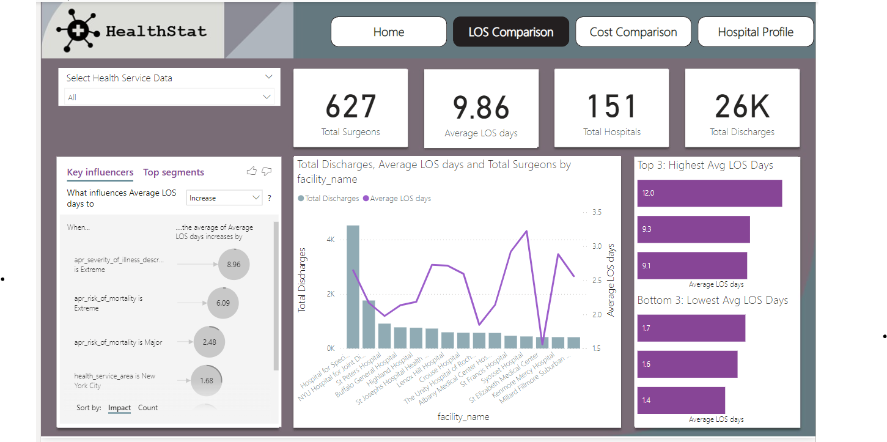

# Healthcare Analytics Dashboard in Power BI

## Project Overview
This project analyzes healthcare data to provide insights on patient demographics, hospital performance, and healthcare metrics. The Power BI dashboard visualizes trends and key performance indicators essential for decision-making in healthcare.

## Project Files
- **Healthcare Analytics Dashboard.pbix**: The Power BI file containing all data, visualizations, and analysis.
- **screenshots/overview.png**: A screenshot of the Power BI dashboard's home page, showing an overview of the main metrics.
- **README.md**: Documentation describing the project, methodology, and insights.
- **Datasets Folder**: Contains the following dataset files used for analysis:
    - **hospital_inpatient_discharges_totalhipreplacement.csv**: Contains data on inpatient discharges for total hip replacement procedures.

## Data and Analysis
The dashboard includes sections for:
1. **Overview**: Key healthcare metrics, such as patient visits, treatment outcomes, and readmission rates.
2. **Patient Demographics**: Insights on age, gender, and geographic distribution of patients.
3. **Hospital Performance**: Analysis of various hospital departments and their efficiency.

## Tools and Techniques
- **Power BI**: Used for data visualization, DAX calculations, and interactive dashboards.
- **DAX Functions**: Applied to calculate metrics and generate key insights for healthcare performance.

## How to Use the Project
1. Download **Healthcare Analytics Dashboard.pbix** from this repository.
2. Open the file in **Power BI Desktop**.
3. Explore the tabs to view insights into healthcare performance metrics.

## Licenses
The dataset is a part of Datacamp learning.
